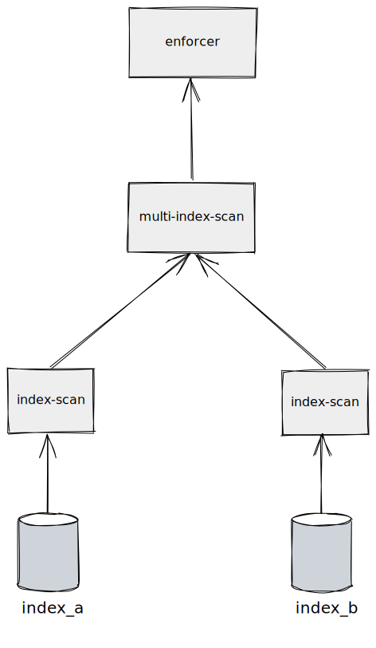

# Executor

## Iterator(Volcano,Pipeline) Model

For now, We only implemented the iterator(non-batch,non-vectorized) version. Welcome to write an RFC and implement a vectorized version for us.

A typical executor includes three interfaces: Init, Next, and Close.

- Init: it's used to init executor resources.
- Next: it's trying to get the output from child executors(if any), and run a specific task yield output. 
- Close: it's used to release allocated resources.

We use a sample example to illustrate how an executor works:

1. A caller calls Enforcer Executor's Init method, the children executors' Init will be called by the parent executor recursively.
2. Enforcer Executor calls child's Next method
3. MultiScan Executor calls one side child's Next method to get output.
    - Uses output to build a hashmap(or bitmap, Btree, etc.) to yield the intersection set of children's output (row ids).
    - Calls another side child's Next method(can run parallel), uses hashmap to probe intersection set.
4. Enforcer yields the final result.
5. Finally, Enforcer Executor's Close was called, the children executors' Close will be called by parent executor recursively.
