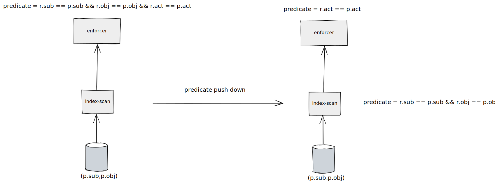
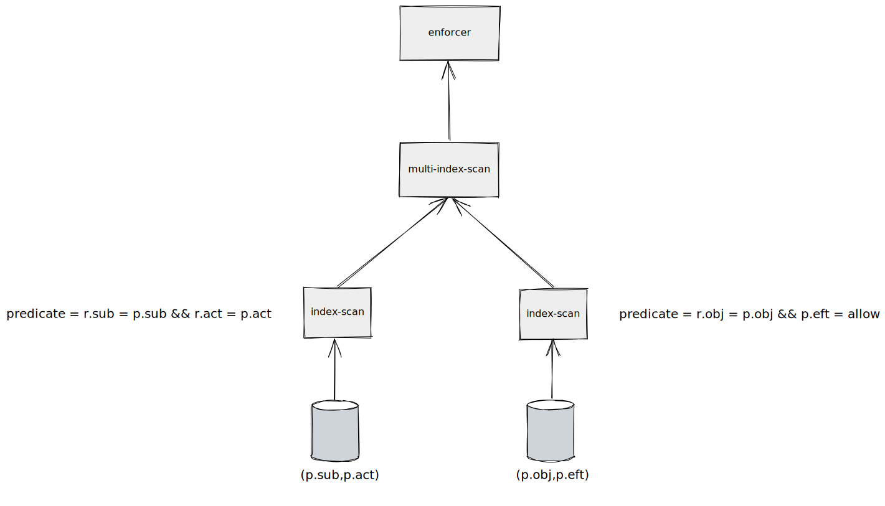

# Index

indexes are used to find rows with specific column values quickly. If the table has an index for the columns in the quire, NEO can quickly find the position to seek. In most cases, an index is much faster than a full-scan.
## Type of indexes

In Neo we will mainly exploit secondary indexes. Assuming we have the model definition:

```
[request_definition]
r = sub, obj, act

[policy_definition]
p = sub, obj, act

[policy_effect]
e = some(where (p.eft == allow))

[matchers]
m = r.sub == p.sub && r.obj == p.obj && r.act == p.act
```

### Secondary indexes

#### Single-column indexes

Single column indexes only include a one-column value. for example, assuming we have single-columns on `p.sub`, `p.obj`, `p.act` separately. Neo typically uses one of these indexes with the most selective(which means it has the smallest row).

e.g., for quire `alice,data,read` , the selectivity of `p.sub`, `p.obj`, `p.act` are 1%,%2 and %50 separately, obviously, we will use the index on `p.sub` in this quire.

#### Multiple-columns indexes

Multiple-column indexes include multiple-columns. e.g., if we have a three-column index on (`p.sub`, `p.obj`), we have indexed search capabilities on (`p.sub`), (`p.sub`, `p.obj`).

##### Predicates Push Down

Furthermore, we also can push down the predicates to the index scan executor, which means we can retrieve fewer rows from a table.



##### Multiple-indexes Scan

If we have indexes that cover all attributes of a tuple, we no longer need to retrieve rows from a table via the primary key. Neo will push down the predicates and use a multi-index-scan to yield the interaction set.

The selectivity of a multiple columns index will depend on the leftmost value. e.g., the selectivity of `p.sub`, `p.obj`, `p.act` are 1%,%2 and %50, therefore the selectivity of (`p.sub`, `p.act`) is 1%. You can exploit this to maximum performance for queries.

