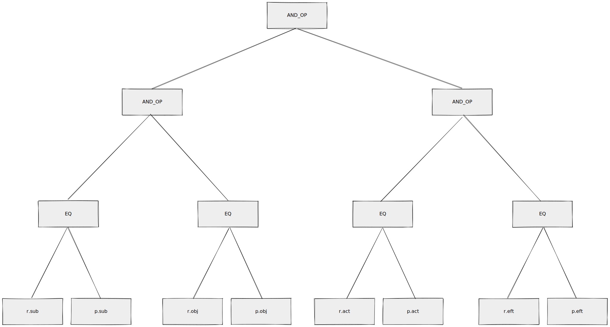
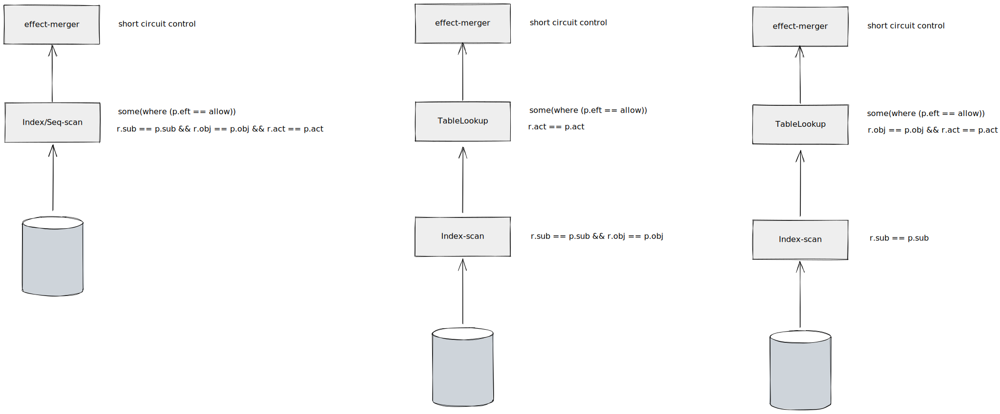

# Planner

In Neo, we implemented a naive planner, which includes physical plan generation and physical plan optimization.

## Physical plan generation

After the user defines the model, the Neo will store several physical plans equivalent to the model's matcher for future use in the physical optimization.

e.g. 

We have the following model:
```
[request_definition]
r = sub, obj, act

[policy_definition]
p = sub, obj, act

[policy_effect]
e = some(where (p.eft == allow))

[matchers]
m = r.sub == p.sub && r.obj == p.obj && r.act == p.act

```
The parsed ast looks like:




It might generate the following equivalent Physical plans:



The first equivalent plan with a seq-scan is a naive plan. It's not dependent on the table indexes. If a table doesn't include any indexes, the planner will not generate others but a naive plan.

If a table has a multi-index on column `sub`,`obj`, a single-index on column `obj`, then  the planner will generate all the above plans. 
To be more specific, the planner will generate:
1. A physical plan with a table full-scanning
2. A physical plan that pushes down a partial predicate to an index-scan executor where it might yield less output.
3. A physical plan uses an index-scan executor to filter the value of columns `sub` or `obj`, then uses table lookup to retrieve the tuple and applies a predicate to yield output.

## Physical plan optimization

Physical plan optimization typically does one thing, it uses statistics to estimate the cost of the physical plans and find the optimal plan.

1. Full-seq-scanning or index scan
   - There is the circumstance where an equivalent query using an index has a low selectivity(which means it has a lot of rows) and is even slower than a full-table scanning plan.
2. Uses which index
   - It bases the cost model to figure out which physical plan is optimal